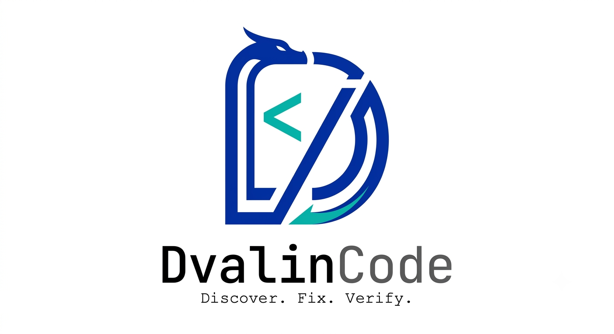
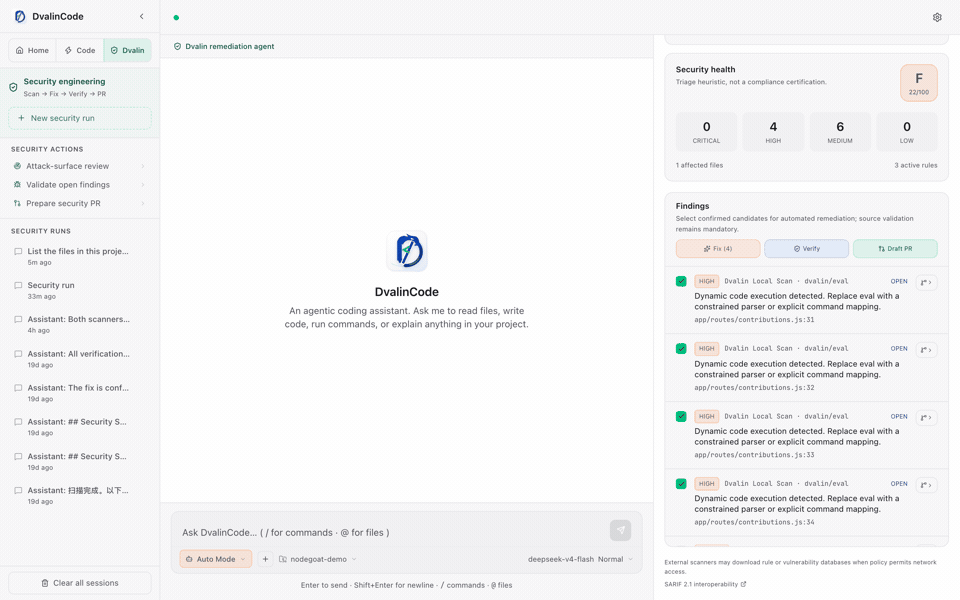
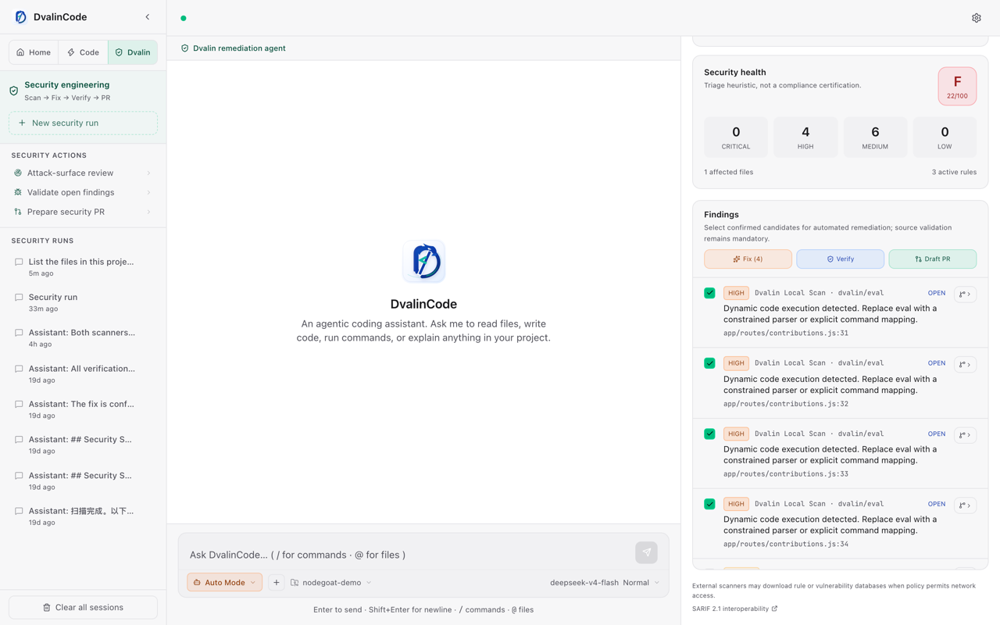
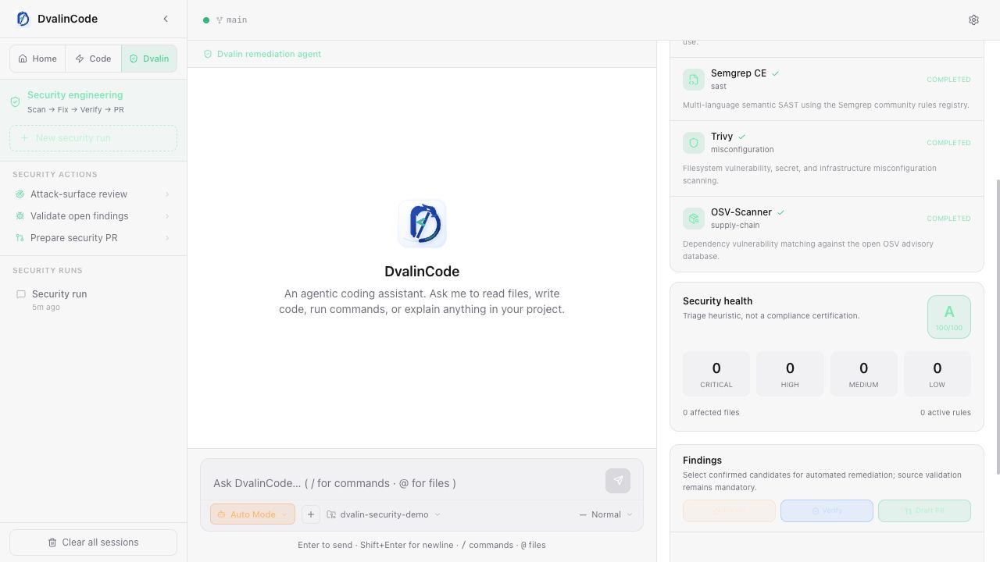
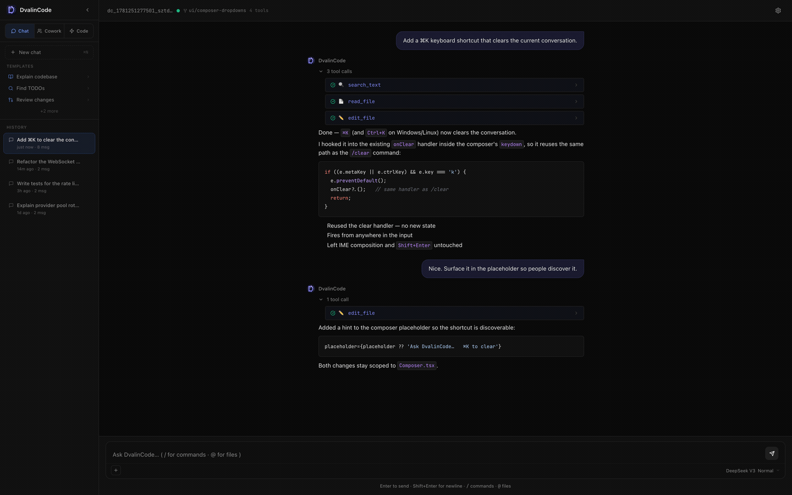

<p align="center">
  
</p>

<p align="center">
  <b>English</b> · <a href="README.zh-CN.md">中文</a> · <a href="https://dvalincode.dev">🌐 dvalincode.dev</a>
</p>

<p align="center">
  <a href="https://github.com/arthurpanhku/dvalincode/releases/latest"></a>
  <a href="https://github.com/arthurpanhku/dvalincode/releases"></a>
  <a href="#-tests"></a>
  <a href="LICENSE"></a>
  <a href="https://scorecard.dev/viewer/?uri=github.com/arthurpanhku/dvalincode"></a>
  <a href="#-quick-install"></a>
  <a href="#-providers"></a>
  <a href="README.zh-CN.md"></a>
</p>

<p align="center">
  <b>Find the security holes in your repo, fix them, and prove the fix — in one command.</b><br>
  Every fix is diffed, tested, re-scanned, and recorded in a tamper-evident audit log before it can become a PR.
</p>

---

## ⏱️ 30 seconds, no install, no API key

```sh
npx dvalincode dvalin .
```

That is the whole thing. It runs the built-in rules for injection, hardcoded
secrets, XSS, `eval`, and unsafe shell use against the current directory and
prints what it found. No account, no model, no config, no code leaves your
machine. Add `--scanners builtin,semgrep,trivy,osv-scanner` to pull in whichever
of those engines you already have on `PATH`.

### Or put it on every pull request — nothing to install at all

```yaml
# .github/workflows/security.yml
permissions:
  contents: read
  security-events: write
steps:
  - uses: actions/checkout@v5
  - uses: arthurpanhku/dvalincode@v0.17.0
    with:
      fail-on: high
```

Findings land inline on the pull request diff and in your Security tab.
No API key, no secrets, no model — the scan is deterministic and local to the
runner. [Full example →](docs/examples/dvalin-scan.yml)

### Or let your agent call it

If an agent is writing the code, something other than that agent has to check
it. DvalinCode is an MCP server, so any agent that speaks MCP can:

```sh
claude mcp add dvalin -- npx -y dvalincode mcp-serve --workspace .
```

`dvalin_scan` is read-only and deterministic — no model runs, no credentials are
needed, no files are touched — so an agent can call it after every edit. A real
call against a vulnerable fixture returns in ~170ms with a ~600 byte payload.
The same server also exposes `dvalin_run_task` for delegating a whole governed
task, plus the session and audit-evidence tools.

Verified end to end with both Claude Code and Codex driving a real tool call
against the published package, not only completing a handshake.
[Agent integrations →](integrations/)

### Then let it fix what it found

```sh
dvalincode dvalin . --fix --verify --draft-pr
```

This step *does* use a model — your model, any OpenAI-compatible endpoint. It
prepares focused repairs in an isolated worktree, runs your tests, and requires
a clean re-scan before anything can proceed to a draft PR. It never auto-merges,
and a clean scan is never treated as proof that the code is safe.

<p align="center">
  
</p>

This animation is made from the real application, not a mock. The input is an
Apache-2.0-licensed example adapted from
[OWASP NodeGoat](https://github.com/OWASP/NodeGoat/tree/c5cb68a7084e4ae7dcc60e6a98768720a81841e8/app/routes),
whose contribution route evaluated user-controlled text.

## 🛡️ What that run actually did

Dvalin turns open-source scanner evidence into a controlled scan → fix → test →
re-scan → draft-PR workflow. Here is the run in the animation above, measured:

| Real NodeGoat-derived run | Before | After Dvalin remediation |
|---|---:|---:|
| Security health (triage heuristic) | 22 / 100 · F | 100 / 100 · A |
| Findings | 10 (`eval` across 3 rules, 2 engines) | 0 |
| Tests | 2 passing | 3 passing, including an injection regression test |
| Scanner fleet | 4 / 4 completed | 4 / 4 completed |

The scanning and hardening **control plane** uses open-source components:

- [Semgrep CE](https://github.com/semgrep/semgrep) and its community rules for
  semantic SAST.
- [Trivy](https://github.com/aquasecurity/trivy) for filesystem vulnerabilities,
  secrets, and misconfiguration.
- [OSV-Scanner](https://github.com/google/osv-scanner) with the open
  [OSV database](https://osv.dev/) for dependency vulnerabilities.
- DvalinCode's MIT-licensed built-in rules, remediation orchestration, test and
  re-scan gates, plus [SARIF 2.1](https://docs.oasis-open.org/sarif/sarif/v2.1.0/sarif-v2.1.0.html)
  import for other compatible scanners.

The scanners find and rank evidence. The configured model proposes source
changes; DvalinCode constrains that work, records the diff, runs project tests,
re-scans the changed tree, and keeps PR publication explicit. It does not
auto-merge and it does not claim that a clean scan proves the absence of bugs.
Choose an open-weight model through Ollama if the repair-proposal step must also
stay fully local and open; hosted model licensing depends on the provider.

You can still prove what the agent did after the fact:

```sh
dvalincode report verify    # re-derive the hash chain of the last run's audit log
```

---

## 🏛️ And it survives a security review

That last command is the part that matters once more than one person depends on
this. DvalinCode is a full coding agent — terminal, web GUI, and desktop app —
built so that an organization, not the developer, bounds what it may do: a
policy file constrains modes, commands, paths, tools, and models; every run is
hash-chained into a tamper-evident audit log; nothing reaches a provider that
the egress guard did not allow. A repo policy can only ever *narrow* the
machine-level one.

If you are the person who has to approve this class of tool, start at
[APPROVABILITY-PLAN.md](docs/APPROVABILITY-PLAN.md) and the
[Evidence Pack](docs/EVIDENCE-PACK.md) that every release ships of itself.

---

<table>
<tr><td><b>🏠 Home</b></td><td>One place for read-only <b>Ask</b> and approval-gated <b>Collaborate</b> workflows. Switch intent without leaving the project or conversation.</td></tr>
<tr><td><b>⚡ Code</b></td><td>Focused autonomous coding with full tool access and Ask / Plan / Auto / Bypass permission levels. Security and browser routines no longer compete with the core coding workflow.</td></tr>
<tr><td><b>🛡️ Dvalin</b></td><td>Dedicated white-box security engineering: orchestrate the built-in scanner plus installed Semgrep CE, Trivy, and OSV-Scanner; triage findings; create isolated fixes; run tests and re-scan; then explicitly publish a reviewable draft PR. <a href="docs/DVALIN.md">Dvalin guide →</a></td></tr>
<tr><td><b>🏦 Regulated teams</b></td><td>Designed for finance, healthcare, security-sensitive SaaS, and internal platform teams that need AI coding under policy, audit, data minimization, and supply-chain review — not just developer convenience.</td></tr>
<tr><td><b>🛡️ Secure remediation</b></td><td>Run a multi-engine scan or import SARIF from CodeQL, GitHub Code Scanning, Semgrep, or compatible scanners, then create an isolated remediation worktree and turn findings into focused repair tasks with source context, verification evidence, and PR-ready reporting. <a href="docs/SECURE-REMEDIATION.md">Workflow →</a></td></tr>
<tr><td><b>📚 Skills</b></td><td>Upload, download, and inspect local skill bundles. DvalinCode ships built-in secure-code-scan and secure-code-remediation skills, plus agent tools for listing skills, reading skill instructions, scanning, listing cases, and preparing remediation worktrees. <a href="docs/SKILLS.md">Format →</a></td></tr>
<tr><td><b>🛡️ Audit trail</b></td><td>Every run emits a tamper-evident, hash-chained JSONL log — every file read/written, every command, every approval. A Run Report renders it as Markdown; <code>dvalincode report verify</code> proves the chain is intact. <a href="docs/AUDIT-TRAIL.md">Threat model →</a></td></tr>
<tr><td><b>🔒 Org policy &amp; <code>trust</code></b></td><td>A company — not the developer — bounds the agent. A <code>dvalin.policy.json</code> constrains modes, shell commands, file paths, tools, and models; a repo policy can only ever <i>narrow</i> the machine-level one, never widen it. Each run records the governing policy's hash. <code>dvalincode trust</code> prints the install's live security posture — active policy + hashes, audit status, runtime — so a reviewer can verify it directly. <a href="docs/POLICY-REFERENCE.md">Policy reference →</a> · <a href="docs/APPROVABILITY-PLAN.md">Approvability plan →</a></td></tr>
<tr><td><b>🏛️ Governance evidence</b></td><td>OpenSSF Scorecard, CodeQL, Dependabot, pinned GitHub Actions, CODEOWNERS, and ISO/IEC 42001 AIMS alignment docs are maintained as reviewable project evidence, and every release ships an Evidence Pack the binary produced of itself. <a href="docs/security/OPENSSF-SCORECARD.md">Scorecard map →</a> · <a href="docs/governance/ISO-42001-AIMS.md">ISO 42001 alignment →</a> · <a href="docs/RELEASE-EVIDENCE.md">Release evidence →</a></td></tr>
<tr><td><b>📐 Open specs</b></td><td><b>PCP-1</b> — the provider-boundary contract (egress containment, credential containment, audit, policy binding) written as a vendor-neutral profile with test procedures, so any agent runtime can run it against its own adapters and publish the result. Not a DvalinCode test file; a checklist anyone can hold us to as well. <a href="docs/spec/PROVIDER-CONFORMANCE.md">Provider Conformance Profile →</a></td></tr>
<tr><td><b>🖥️ First-class GUI</b></td><td>Modern web UI with code highlighting, file <code>@</code>-references, <code>/</code> slash commands, Git branch indicator, live token + cost counter, multi-profile LLM config, and a dark / light / system theme switcher.</td></tr>
<tr><td><b>🖥️ Terminal or web — one binary</b></td><td>Run it bare for an interactive <b>terminal agent</b> with streaming output, inline approvals, and red/green diffs, or <code>dvalincode serve</code> to host the <b>web GUI</b> for browser/remote use. Both frontends drive the same agent core.</td></tr>
<tr><td><b>🖥️ Native desktop app</b></td><td><code>DvalinCode.app</code> — a real dock application (OS-native webview, no Electron) over the same engine. On macOS the one-line installer puts it in <code>/Applications</code> automatically; launch it straight from Launchpad.</td></tr>
<tr><td><b>🪶 Zero-dependency binary</b></td><td>Single ~25MB executable per platform. No Node, no Python, no Docker.</td></tr>
<tr><td><b>🔐 Local-first</b></td><td>Sessions, config, profiles, and audit logs live in <code>~/.dvalincode/</code>. <code>.dvalincodeignore</code> blocks the agent from reading sensitive files. <code>AGENTS.md</code> in your repo becomes persistent project instructions.</td></tr>
<tr><td><b>💾 Portable & exportable</b></td><td>Export <b>all</b> local data (memory, sessions, config, audit) to one file and import it on another machine — your setup moves with you. Any conversation downloads as a clean <b>Markdown</b> transcript.</td></tr>
</table>

---

## 🎯 Core Goal

> **Make AI coding approvable for regulated and security-sensitive teams.**

DvalinCode is built as an **approvable agent runtime**, not just another coding
agent app. The core product is not only "AI writes code"; it is the evidence a
security, compliance, or platform team needs to safely allow AI coding in
financial services, healthcare, internal enterprise platforms, and other
confidential codebases.

- **Any model** — every OpenAI-compatible endpoint is a first-class citizen, local models included. Your workflow should never be hostage to one vendor's pricing, rate limits, or quality swings.
- **Safe by default** — three-tier approvals with diff preview, an undo stack, and sandboxed shell execution. An agent you can trust on full-auto.
- **Small enough to audit** — one ~25MB binary, a handful of runtime dependencies, a codebase you can read in a weekend. Trust through inspection, not promises. As of v0.5, **every agent run is auditable too**: a tamper-evident, hash-chained log of every action, verifiable after the fact.
- **Open enough to embed** — the agent core speaks a clean REST + WebSocket API, ready to be wired into your own product, CI, or internal tools.
- **Approvable by any company** — governance is built in, not bolted on. An org policy bounds the blast radius (**controllable**), `dvalincode trust` makes the posture self-verifiable (**transparent**), and the hash-chained log proves what every run did (**auditable**). Those three together are exactly what a security review needs to say yes — and what cloud, closed, mutable-log agents structurally struggle to provide. [Approvability plan →](docs/APPROVABILITY-PLAN.md)

The bundled **web GUI is the runtime's reference implementation and showcase** — the first consumer of that public API, demonstrating everything the runtime can do.

---

## ✅ Why Teams Pick DvalinCode

DvalinCode is differentiated by **approvability**. It is built for teams that
need AI coding to pass security, compliance, and data-governance review before
it can touch production repositories.

- **Closed-loop secure remediation** — scan locally or import SARIF from
  CodeQL, GitHub Code Scanning, Semgrep, or compatible scanners; persist
  findings as local remediation cases; create an isolated
  `dvalin/remediate/...` worktree; then send a focused repair prompt with
  source context and verification instructions.
- **Skills as governed operating procedures** — upload, download, and inspect
  local skill bundles. Built-in secure scanning and remediation skills tell
  agents which tools to use and keep workflows portable across machines.
- **Model freedom without policy drift** — use DeepSeek, OpenAI, Claude via
  OpenRouter, Groq, Ollama, or any OpenAI-compatible endpoint while keeping
  tool permissions, audit, and workspace policy consistent.
- **Security evidence, not just security claims** — OpenSSF Scorecard support,
  CodeQL, Dependabot, pinned Actions, CODEOWNERS, ISO/IEC 42001 alignment docs,
  AI change-impact records, and hash-chained run logs are part of the project.
- **Local-first by default** — sessions, config, profiles, memory, and audit
  logs stay under `~/.dvalincode/`; `.dvalincodeignore` and policy controls
  bound what the agent can read, write, or execute.

---

## 🛡️ Security & Governance

<p align="center">
  <a href="docs/governance/ISO-42001-AIMS.md"></a>
  <a href="docs/EVIDENCE-PACK.md"></a>
  <a href="docs/security/OPENSSF-SCORECARD.md"></a>
</p>

DvalinCode maintains project-level governance evidence for open-source and
enterprise review. This is the differentiator for teams where AI coding must
pass security approval before it can reach production repositories:

- **Threat model** — the full attack surface of an agentic coding runtime
  (malicious `AGENTS.md`, poisoned MCP servers, prompt-injection escalation,
  egress, audit tampering, supply chain, sandbox escape), each mapped to the
  control that defends it and the honest residual gap. [Threat model →](docs/THREAT-MODEL.md)
- **OpenSSF Scorecard support** — scheduled Scorecard workflow, SARIF upload,
  CodeQL, Dependabot, CODEOWNERS, least-privilege workflow permissions, and
  SHA-pinned GitHub Actions. [Control map →](docs/security/OPENSSF-SCORECARD.md)
- **ISO/IEC 42001 alignment** — an AI management system scope, AI policy, role
  map, risk register, AI change classification, required records, and review
  cadence. [AIMS alignment →](docs/governance/ISO-42001-AIMS.md)
- **AI change impact assessment** — a reusable template for changes that affect
  model/provider behavior, prompts, permissions, tools, audit logs, or release
  security. [Template →](docs/governance/AI-CHANGE-IMPACT-ASSESSMENT.md)
- **Regulated-use posture** — local-first data handling, policy-controlled
  autonomy, minimized audit records, and release supply-chain evidence for
  finance, healthcare, security-sensitive SaaS, and internal enterprise use.
- **Dvalin security engineering** — the dedicated Dvalin workspace combines the
  built-in scanner with installed Semgrep CE, Trivy, and OSV-Scanner, normalizes
  SARIF findings, drives isolated test-backed fixes, and explicitly prepares a
  reviewable draft PR without auto-merging it.
  [Workflow →](docs/SECURE-REMEDIATION.md)

These documents are implementation evidence and operating procedures; they do
not claim third-party ISO certification.

---

## ⭐ What's New in v0.14.0 — Dvalin security engineering

- **Home unifies Chat and Cowork** — the GUI now has a single Home workspace
  with read-only Ask and approval-gated Collaborate intents, while keeping the
  same project and conversation context.
- **Code is focused again** — the old Security and Routines panels have been
  removed from Code so its sidebar is dedicated to projects and autonomous
  implementation.
- **Dvalin is a first-class workspace** — orchestrate the built-in scanner plus
  installed Semgrep CE, Trivy, and OSV-Scanner; import SARIF; score and triage
  findings; persist remediation cases; and create isolated repair worktrees.
- **One flow from evidence to draft PR** — selected findings can launch an
  evidence-backed Agent fix, run focused tests/typecheck/build and a fresh scan,
  review the diff, and explicitly publish a draft PR without automatic merge.
- **Agent loops converge sooner and cost less** — investigation-before-edit and
  stall detection reduce repeated failed actions, general tool output is
  bounded, prompts remain append-only for cache reuse, and provider usage now
  accounts for cache hits/misses.
- **Provider and evaluation upgrades** — native Anthropic prompt caching and
  cache accounting are supported, and the SWE-bench Docker harness reports
  official scores, policy violations, stalls, and token/cache metrics.

---

## ⭐ What's New in v0.12.4 — finish the task before stopping

- **Process narration no longer ends a task** — responses such as “let me
  verify the file” are recognized as pending work, and the agent immediately
  continues with the promised action instead of treating them as a final answer.
- **Truncated responses automatically recover** — provider finish reasons are
  preserved, so output cut off by a token limit triggers another model step.
- **Normal coding turns get room to finish** — the per-turn action limit is now
  an emergency 100-action guard rather than a routine 15-action stopping point;
  stricter organization policy limits still take precedence.
- **Completion is explicit** — Code mode is instructed to return a tool-free
  answer only after the requested work and focused validation are complete.

---

## ⭐ What's New in v0.12.3 — resilient long-running Code mode

- **Long coding turns keep going** — Code mode now compacts context during an
  active tool loop, accounts for the full provider request when estimating
  tokens, and raises the default iteration checkpoint from 10 to 40.
- **Interruptions are resumable** — completed tool state is persisted when a
  turn is interrupted or its connection closes, so a follow-up `continue`
  resumes from the actual workspace progress.
- **Visible, quieter agent activity** — running sessions show a sidebar loading
  state, each response reports elapsed work time, and its Action timeline is
  available on click while raw Tool Calls stay collapsed by default.
- **GitHub workflows from Code mode** — network-aware `git` and GitHub CLI
  (`gh`) operations now support pull, push, PR creation, and Actions/repository
  commands through the governed shell approval path.
- **Safer releases** — package and CLI versions are synchronized, and
  `prepublishOnly` runs the build, typecheck, and test suite before publishing.
- **Simple tasks stay simple** — the Action budget is enforced across the whole
  turn instead of resetting on every model iteration, and Code mode is prompted
  to take the shortest direct path and stop when focused validation passes.

---

## ⭐ What's New in v0.12.2 — 🖥️ Desktop app milestone: it just works

- **🖥️ The native desktop app now works out of the box on macOS** — `DvalinCode.app`
  opens a real dock window (WKWebView, no Electron) over the embedded engine.
  Two threading bugs that shipped in every earlier desktop build are fixed:
  the blocking webview loop no longer starves the embedded server (blank
  window), and the webview runs on the main thread as macOS requires (no
  window at all) — the server now lives in a child process of the same binary.
- **📦 The one-line installer installs the app** — on macOS,
  `curl … install.sh | bash` now also puts `DvalinCode.app` (with the
  DvalinCode icon) into `/Applications`, so the desktop window launches
  straight from Launchpad after a CLI install. Opt out with
  `DVALINCODE_NO_APP=1`; pin with `DVALINCODE_GUI_VERSION`.
- **✅ Desktop is no longer "experimental" on macOS** — the window and the
  embedded server are verified working; Windows and Linux desktop builds are
  cross-compiled and remain a preview.

<details>
<summary>v0.9.0 — 🛡️ Secure remediation · Skills · CodeQL hardening</summary>

- **🛡️ Secure remediation workflow** — run a built-in local scan or import SARIF
  from CodeQL, GitHub Code Scanning, Semgrep, and compatible scanners; findings
  become local remediation cases with source context, verification guidance, and
  isolated worktree repair tasks.
- **📚 Skills** — upload, download, inspect, and reuse local skill bundles.
  DvalinCode now ships built-in secure-code-scan and secure-code-remediation
  skills, plus agent tools for listing skills, reading instructions, scanning,
  listing remediation cases, and preparing remediation worktrees.
- **🔐 CodeQL path hardening** — user-controlled workspace, remediation, and
  skill paths now go through explicit root-containment checks, with regression
  tests covering traversal-safe resolution and skill import boundaries.
- **🎨 App icons** — dark and light theme application icons now ship with the web
  bundle and desktop build inputs.

</details>

<details>
<summary>v0.8.0 — 🔒 Governance: controllable · transparent · auditable</summary>

- **🔒 Org policy** — a `dvalin.policy.json` lets a *company*, not the developer, bound the agent: which modes, shell commands, file paths, tools, and models are allowed. Two layers (machine `~/.dvalincode/policy.json` + repo) resolve by **narrowing** — a repo policy can only ever make the machine policy stricter, never widen it. With no policy file, behavior is identical to before. Enforced at a single chokepoint; every denial is an inline `⛔ Blocked by policy` plus a `policy_violation` audit event. [Policy reference →](docs/POLICY-REFERENCE.md)
- **🔎 `dvalincode trust`** — prints this install's live security posture in one command — active policy + source hashes, audit status, runtime, dependencies — so a reviewer can verify what the agent may and may not do directly, instead of taking claims on trust. `--json` for tooling.
- **`dvalincode policy check`** — validates `dvalin.policy.json` against the schema, prints the resolved policy + canonical hash (after narrowing with the machine layer), and exits non-zero on failure — for CI and policy authoring. [Policy reference →](docs/POLICY-REFERENCE.md)
- **🧾 Policy-aware audit** — every run records the hash of the governing policy (and which files contributed) in `run_start`, so the tamper-evident log proves *which* rules were in force.
- **📐 Approvability plan** — the through-line is documented in [docs/APPROVABILITY-PLAN.md](docs/APPROVABILITY-PLAN.md): make DvalinCode trivially approvable by any company — controllable, transparent, auditable.

</details>

<details>
<summary>v0.7.0 — 🧪 Desktop app (beta)</summary>

- **🧠 Portable memory & full data export/import** — the upgraded local memory mechanism, plus every session, config, profile, and audit log, can now be bundled into a single file and restored on another machine. Migrate your whole setup in one step: `dvalincode export` / `dvalincode import`, or the **Export / Import** buttons in the GUI Settings panel.
- **📝 Download any AI interaction as Markdown** — every conversation can be saved as a clean Markdown transcript (user turns, assistant replies, tool calls + results, decisions — all inline). Use the download icon on any session in the sidebar, `dvalincode session md <id>`, or `GET /api/sessions/:id/markdown`.
- **🖥️ Native desktop app** — a real application window (not a browser tab) over the same engine: `DvalinCode.app` on macOS, plus Windows/Linux builds. Built with [webview-bun](https://github.com/tr1ckydev/webview-bun) using the OS-native webview (WKWebView / WebView2 / WebKitGTK) — no Electron, stays a small self-contained binary.
- **🧩 A third frontend, one core** — the desktop app, terminal UI, and web GUI all drive the same shared turn-runner. The current `dvalincode` binary is now positioned purely as the **CLI** (terminal + `serve`).
- **Status:** the desktop binaries are **experimental / unverified** — grab them from the latest **pre-release** and please report how the window behaves on your OS.

</details>

<details>
<summary>v0.6.0 — terminal agent · <code>serve</code> · shared turn-runner</summary>

- **🖥️ Terminal agent** — run `dvalincode` bare for an interactive terminal coding agent, Claude-Code-style: streaming responses, inline `[y/N]` write approvals with red/green diffs, `/mode` · `/clear` · `/git` · `/plan` · `/compact` · `/undo` · `/help`, Ctrl-C to interrupt, and a guided first-run provider setup. Defaults to read-only **Chat**, switchable live.
- **🌐 `dvalincode serve`** — the web GUI now lives behind a command, so the *same* binary deploys headless on a server: `dvalincode serve --host 0.0.0.0 --no-open`.
- **🧩 One engine, two frontends** — the terminal UI and web GUI both drive a shared, transport-agnostic turn-runner (`src/agent/session.ts`), keeping them at feature parity.

</details>

<details>
<summary>v0.5.0 — security-grade audit trail · Run Report · theme switcher</summary>

- **🛡️ Security-grade audit trail** — every Cowork/Code run writes a tamper-evident, hash-chained JSONL log to `~/.dvalincode/audit/` (`run_start`, every `tool_call` / `file_*` / `shell_exec` / `approval`, `run_end`). The hash chain makes any after-the-fact edit detectable. No local coding agent ships verifiable behavior logs. [Format + threat model →](docs/AUDIT-TRAIL.md)
- **📋 Run Report + `dvalincode report` CLI** — a Markdown summary of each run (files read/changed, commands, decisions, test result), rendered as a collapsible card in the GUI and from the CLI:
  ```sh
  dvalincode report --last           # render the most recent run
  dvalincode report <run-id> --format json
  dvalincode report verify <run-id>  # ✓ chain intact / ✗ broken at seq N
  ```
- **🎨 Theme switcher** — choose **dark / light / system** in Settings. `system` follows your OS live; the choice persists across sessions.

</details>

<details>
<summary>v0.4.0 — <code>/compact</code> · <code>dvalin.json</code> team playbook · self-contained binaries</summary>

- **`/compact`** — LLM-based context compaction: replaces conversation history with a structured five-section summary (Goal / Completed / Decisions / Current State / Pending). A divider in the chat thread shows the token reduction (e.g. `8,412 → 1,203 tokens −85%`).
- **`dvalin.json` team playbook** — commit a shared set of automation prompts to your repo. The sidebar loads them automatically and lets teammates run the same one-click routines without any manual setup. Export button converts your personal routines to `dvalin.json` in one click.
- **Self-contained binaries** — single ~25 MB executable per platform; no Node, no Python, no Docker. Auto-opens your browser on launch. Built with `bun --compile` so the web UI is bundled alongside the server binary.

</details>

<details>
<summary>v0.3.0 — Mode-aware sidebar · one-line installer · multi-profile LLM config</summary>

- **Mode-aware sidebar** — Chat shows quick-prompt **Templates**, Cowork shows a **Projects** folder tree, Code shows custom **Routines** (one-click commands like "Run tests" / "Git status" / "Type check"). Add your own routines from the sidebar — they persist in `localStorage`.
- **One-line installer** — `curl … | bash` auto-detects your OS + arch, drops the binary into `~/.dvalincode/`, and patches your `PATH`. No package manager dependencies.
- **Multi-profile LLM config** — save named (provider, model, API key) sets and switch in one click from the sidebar; live per-session cost counter in the topbar so you can compare providers on the fly.

</details>

---

## 📸 Preview

**A real Dvalin scan of vulnerable code — Security health 22/100 · F, with the
10 findings the engines actually reported, located to the line:**

<p align="center">
  
</p>

**The verified result — the three `eval` call sites replaced by a constrained
numeric parser, one new injection regression test, all four open-source engines
complete, 0 findings, 100/100 · A:**

<p align="center">
  
</p>

**Home → Code → Dvalin — the current workspaces:**

<p align="center">
  
</p>

The scan images above are unedited captures of a real run against the documented
NodeGoat-derived case: the scanners were run, the model repaired the source, the
project's tests were run, and the tree was re-scanned. Nothing is staged, and a
100/A means the configured engines found nothing — not that the code is proven
safe.

---

## 🆚 When to choose DvalinCode

| If you need… | DvalinCode's answer |
|---|---|
| **An agent your security team can approve** | Policy-bound tools, explicit approval modes, `dvalincode trust`, audit logs, OpenSSF evidence, and ISO/IEC 42001 alignment docs. |
| **AI coding for regulated repositories** — finance, healthcare, enterprise data, customer-confidential code | Local-first runtime, bring-your-own-model, `.dvalincodeignore`, governed egress, and minimized audit records. |
| **A safer alternative to generic autonomous coding agents** | The product thesis is controllable / transparent / auditable, not only "the model can edit files". |
| **IDE-centric AI workflows** | Zero-dep binary (~25 MB). Runs anywhere, no IDE required. macOS shell is sandboxed by default — network denied, writes capped to `cwd`. |
| **Terminal-first AI workflows** | CLI start → auto-opens a modern Web UI with code highlighting and red/green diff approval. One install command, nothing else needed. |
| **Cloud-only AI workflows** | Every OpenAI-compatible endpoint is a first-class citizen. Run Ollama with Qwen2.5-Coder: no key, no internet, no per-token cost. |
| **Single-machine AI setup** | `AGENTS.md` committed to the repo ships AI context to every clone. `dvalin.json` ships the team's automation commands the same way — export from the sidebar, commit, done. |

---

## 🚀 Quick Install

### Homebrew (macOS / Linux)

```sh
brew tap arthurpanhku/dvalincode https://github.com/arthurpanhku/dvalincode
brew install arthurpanhku/dvalincode/dvalincode
```

Installs the same signed-by-checksum release archive the one-liner does, and
`brew upgrade` keeps it current. Homebrew never applies the macOS quarantine
attribute, so this path is not subject to Gatekeeper.

### macOS / Linux (one-liner)

```sh
curl -fsSL https://raw.githubusercontent.com/arthurpanhku/dvalincode/main/scripts/install.sh | bash
```

Detects your OS + arch, downloads the right binary, installs to `~/.dvalincode/`, and adds it to your `PATH`. On macOS it also installs the native **DvalinCode.app** into `/Applications` (skip with `DVALINCODE_NO_APP=1`), so the desktop window launches straight from Launchpad. After reload:

```sh
source ~/.zshrc    # or ~/.bashrc
dvalincode                       # interactive terminal agent
dvalincode dvalin .              # white-box security scan (GUI-independent)
dvalincode serve                 # start the web GUI, open the browser
dvalincode serve --host 0.0.0.0 --no-open   # host it on a server for remote/browser use
echo "inspect src and summarize" | dvalincode run - --output-format stream-json
dvalincode mcp-serve             # task-level stdio MCP server for external agents
```

Headless `run` and `mcp-serve` keep the same policy and audit chokepoint as
the interactive clients. See the [unattended recipes](docs/RECIPES-UNATTENDED.md)
for cron, CI, and external-agent examples.

### Windows

Download `dvalincode-v*-windows-x64.zip` from [Releases](https://github.com/arthurpanhku/dvalincode/releases/latest), unzip, then double-click `start.bat`.

### Manual download

Grab the archive for your platform from the [Releases page](https://github.com/arthurpanhku/dvalincode/releases/latest):

| Platform | Archive |
|---|---|
| macOS Apple Silicon (M1/M2/M3) | `dvalincode-v*-macos-arm64.tar.gz` |
| macOS Intel | `dvalincode-v*-macos-x64.tar.gz` |
| Windows x64 | `dvalincode-v*-windows-x64.zip` |
| Linux ARM64 | `dvalincode-v*-linux-arm64.tar.gz` |
| Linux x64 | `dvalincode-v*-linux-x64.tar.gz` |

Verify against `SHA256SUMS.txt` (included in each release).

Each release also ships **`dvalincode-v*-evidence.json`** — an Evidence Pack the
shipped binary produced of itself on the build machine: two real governed runs,
one allowed and one blocked by policy, with their hash chains. You can check the
claims on this page before installing anything:

```sh
dvalincode evidence verify dvalincode-v0.14.0-evidence.json   # offline, reads only the file
```

The pack's checksum is inside `SHA256SUMS.txt`, which is the subject of the
release's build-provenance attestation. [How it is produced →](docs/RELEASE-EVIDENCE.md)

> **macOS Gatekeeper:** binaries are unsigned. On first run, either clear the quarantine flag with `xattr -dr com.apple.quarantine ~/.dvalincode`, or right-click the binary in Finder → Open → confirm.

### Staying up to date

DvalinCode updates itself — no need to re-run the installer:

```sh
dvalincode update --check   # is a newer release out? (read-only)
dvalincode update           # download, verify, and install the latest
```

It finds the newest release on GitHub, and for a binary install downloads the
matching archive, **verifies it against the release's `SHA256SUMS.txt` before
swapping anything in**, then replaces `~/.dvalincode/` in place. npm installs are
updated via `npm i -g`, and source checkouts are pointed at `git pull`. Add
`-y` to skip the prompt, `--prerelease` to track pre-releases, or `--json` for
scripting.

The macOS desktop app checks the separate `gui-v*` release track when it starts.
When a newer GUI is available, it asks before downloading, verifies the archive
against `SHA256SUMS-gui.txt`, validates the app version, then replaces and
restarts `DvalinCode.app`. A failed replacement rolls back to the previous app.

---

## 🎬 First-time setup

**Terminal (default):** run `dvalincode`. On first launch it walks you through a one-time provider setup (pick a provider, paste your API key, choose a model) and saves it to `~/.dvalincode/config.json`. Then you're at the prompt — type to chat, `/mode` to switch between Chat / Cowork / Code / Dvalin, `/help` for commands. In the GUI, Chat and Cowork are grouped under **Home**.

**Web GUI:** run `dvalincode serve` and:

1. The server starts on `http://localhost:3000` and your browser opens automatically.
2. Click **LLM Configuration** in the sidebar (bottom-left).
3. Pick a provider, paste your API key, choose a model, hit **Save**.
4. Optional: save the current config as a named profile (e.g. `fast`, `cheap`, `local-ollama`) to switch quickly later.

Both share the same config and sessions in `~/.dvalincode/`.

---

## ✨ Features

| Category | Feature | Notes |
|---|---|---|
| **Modes** | Home / Code / Dvalin | Home contains read-only Ask and approval-gated Collaborate; Code is focused autonomous development; Dvalin is the scan-to-fix security workspace |
| **Code permissions** | Ask Permissions / Plan Mode / Auto Mode / Bypass permissions | Verified behavior: Ask requests approval before writes/commands, Plan is read-only and does not write files, Auto runs operations automatically, Bypass runs without confirmation prompts |
| **Workspaces** | Open folder / Import Git / Add worktree | Cowork and Code can switch to a local folder, clone a Git project, or create a Git worktree from the UI |
| **Governance** | OpenSSF Scorecard / ISO 42001 AIMS alignment | Scorecard, CodeQL, Dependabot, pinned Actions, AI impact assessment, risk register, and review cadence are documented under `docs/security/` and `docs/governance/` |
| **Secure remediation** | Built-in + Semgrep CE + Trivy + OSV-Scanner / SARIF / cases / worktrees / tests / draft PR | Dvalin detects installed engines, normalizes SARIF, scores risk, persists cases, drives evidence-backed fixes, verifies changes, and publishes only after an explicit user action |
| **Skills** | Upload / download / built-in security skills | Skills live under `~/.dvalincode/skills`; built-ins guide security scanning and remediation with dedicated agent tools. [Format →](docs/SKILLS.md) |
| **Composer** | `@` file references | Type `@` for a fuzzy file search; selected files get inlined into the prompt |
| | `/` slash commands | `/clear` `/compact` `/git` `/plan` `/undo` `/help` |
| | Multiline + interrupt | <kbd>Shift</kbd>+<kbd>Enter</kbd> for newline, stop button to abort mid-stream |
| **Tool UI** | Inline diffs | `edit_file` and `write_file` results render as red/green unified diff, default folded |
| | Approval dialog with diff | Cowork mode shows the diff *before* the change is applied |
| | Live tool counter + token + cost | Topbar shows session totals in real time |
| **Agent** | LLM-based context compaction | `/compact` summarises into Goal / Completed / Decisions / Pending |
| | Persistent undo stack | `/undo [N]` reverses the last N tool calls |
| | Run Report | Markdown summary per run (files, commands, decisions, test result) — GUI card + `dvalincode report` |
| | Git awareness | Branch name in topbar; `git_status` tool; git context auto-injected into prompt |
| | `AGENTS.md` project memory | Per-repo persistent instructions, auto-loaded each turn |
| **Security** | Tamper-evident audit trail | Hash-chained JSONL per run in `~/.dvalincode/audit/`; `dvalincode report verify` detects edits |
| | macOS shell sandbox | `sandbox-exec` denies network; allows writes only inside cwd + `/tmp` |
| | `.dvalincodeignore` | gitignore-style exclusion; blocks `read_file` / `list_files` / `search_text` |
| | Per-action approval | Approve/deny each write / delete / shell call in Cowork mode |
| **Appearance** | Theme switcher | Dark / light / system, persisted; `system` follows the OS live |
| **Providers** | OpenAI-compatible endpoints | DeepSeek · OpenAI · Groq · OpenRouter · Ollama · custom |
| | Multi-profile config | Save and switch between named (provider, model, API key) sets |
| **Sessions** | Auto-save + restore | All sessions persisted to `~/.dvalincode/sessions/` as JSON |
| | LLM summary memory | Cross-session summary keeps the agent oriented after restart |
| **Memory** | Local user/project memory | Searchable facts, preferences, and decisions in `~/.dvalincode/memory/`; import from Claude/Hermes/Markdown |
| **Data portability** | Export / import all data | One bundle of memory + sessions + config + audit — `dvalincode export` / `import`, or GUI Settings → Export / Import |
| | Markdown transcript | Download any conversation as Markdown — sidebar download icon, `dvalincode session md <id>`, or `/api/sessions/:id/markdown` |

---

## ⌨️ Slash Commands

| Command | Description |
|---|---|
| `/clear` | Clear the current conversation (client-side, starts a fresh session) |
| `/compact` | LLM-based context compaction — replaces history with a structured summary |
| `/undo [N]` | Reverse the last N tool calls (default 1) |
| `/git` | Run `git_status` and show branch, recent commits, changed files |
| `/plan <task>` | Ask the agent to plan the task step-by-step *without* executing |
| `/help` | Show all available slash commands |

---

## 🛠️ Architecture

```
┌───────────────────────────┐   ┌─────────────────────────┐
│  Terminal UI (readline)   │   │  Browser GUI (React/Vite)│
│  streaming · approvals    │   │  ChatThread · DiffViewer │
└─────────────┬─────────────┘   └────────────┬────────────┘
              │ in-process          HTTP / WebSocket
              │                ┌───────────────▼─────────────┐
              │                │  Express + ws server         │
              │                │  /api/* · `dvalincode serve` │
              │                └───────────────┬─────────────┘
              └──────────────┬─────────────────┘
┌────────────────────────────▼────────────────────────────┐
│  runAgentTurn — shared turn-runner (src/agent/session)   │
│  provider · prompt (mode · git · AGENTS.md) · session    │
└────────────────────────────┬────────────────────────────┘
                             │
┌────────────────────────────▼────────────────────────────┐
│                    Agent Engine                          │
│  AgentLoop (8-state machine) → AgentRunner              │
│  Streaming · Interrupt · Undo stack · LLM compaction    │
│  run_start / run_end → AuditSink (hash-chained JSONL)   │
└──────────────────────────┬──────────────────────────────┘
                           │ run()
┌──────────────────────────▼──────────────────────────────┐
│  ToolRegistry — Zod schemas + permission gating         │
│  + audit taps: tool_call · file_* · shell_exec          │
│  read_file · list_files · search_text · git_status ·    │
│  write_file · edit_file · delete_file · shell           │
└─────────────────────────────────────────────────────────┘
```

### Agent Loop — 8 States

```
RESTORE → COMPACT → COMMAND → BUILD → RUN → SAVE → RESPOND → DONE
```

1. **RESTORE** — Load session from `~/.dvalincode/sessions/`
2. **COMPACT** — If context near the limit, compress history (LLM summary)
3. **COMMAND** — Handle built-in slash commands
4. **BUILD** — Assemble system prompt (mode prompt + project + git + AGENTS.md)
5. **RUN** — Delegate to `AgentRunner` for the LLM tool-calling loop
6. **SAVE** — Persist session
7. **RESPOND** — Generate cross-session summary memory
8. **DONE**

---

## 🧪 Tests

```sh
npm test
```

**357 tests · 52 files · all green.**

---

## 🏗️ Build from source

Requires [Bun](https://bun.sh) (`curl -fsSL https://bun.sh/install | bash`).

```sh
git clone https://github.com/arthurpanhku/dvalincode
cd dvalincode
npm install
npm run dev:all                 # start backend (3001) + Vite (5173)
```

Build release binaries for every platform:

```sh
bash scripts/build-release.sh   # → release/ with tar.gz / zip + SHA256SUMS.txt
bash scripts/build-release.sh darwin    # macOS only
bash scripts/build-release.sh windows   # Windows only
```

Before publishing a release:

```sh
(cd release && shasum -a 256 -c SHA256SUMS.txt)
unzip -l release/dvalincode-v*-windows-x64.zip | grep 'web/dist/index.html'
tar tzf release/dvalincode-v*-macos-arm64.tar.gz | grep 'DvalinCode.app/Contents/Resources/AppIcon.icns'
```

Windows smoke test: unzip `dvalincode-v*-windows-x64.zip` on Windows and run `start.bat` from the extracted folder. The server should open `http://localhost:3000`. If it reports an `ENOENT` path under `B:\~BUN\root\web\dist`, the compiled Bun virtual path detection has regressed; the packaged binary must resolve `web/dist` beside the extracted executable.

Note: Bun only allows Windows `.exe` icon/metadata injection when compiling on Windows. macOS/Linux cross-builds still produce a valid Windows archive, but without an embedded `.exe` icon.

---

## 🌐 Providers

DvalinCode supports any OpenAI-compatible endpoint. Built-in presets, sorted by cost:

| Provider | Cheapest model | Input / Output | Notes |
|---|---|---|---|
| **Groq** | `llama-3.1-8b-instant` | Free tier | Fastest open models — Llama 3.3 70B, Mixtral |
| **Ollama** | `qwen2.5-coder` | $0 (local) | No API key needed, runs on your machine |
| **DeepSeek** | `deepseek-chat` | $0.14 / $0.28 per 1M | Cheap and strong; v3 nearly matches GPT-4 quality |
| **OpenRouter** | `google/gemini-2.0-flash-001` | $0.10 / $0.40 per 1M | 200+ models including Claude, Gemini, Llama |
| **OpenAI** | `gpt-4o-mini` | $0.15 / $0.60 per 1M | Reliable; `o1` available for deep reasoning |
| **Custom** | — | depends | Any OpenAI-compatible base URL |

DvalinCode shows the per-session cost live in the topbar — flip between providers in the **LLM Configuration** modal, save named profiles, and compare on the fly.

---

## ❓ FAQ

<details>
<summary><b>Does it send my code to a third party?</b></summary>
<br>
Only what the agent sends to the LLM you configured. Sessions, configs, and profiles all live on your machine in <code>~/.dvalincode/</code>. To exclude sensitive files from the agent's view, drop a <code>.dvalincodeignore</code> in your repo root (gitignore-style patterns).
</details>

<details>
<summary><b>Can I run this without an API key?</b></summary>
<br>
Yes — use Ollama. Pull a model (<code>ollama pull qwen2.5-coder</code>), then in the LLM Configuration modal pick the <b>Ollama</b> provider. No key, no internet, no per-token cost.
</details>

<details>
<summary><b>Why Home, Code, and Dvalin?</b></summary>
<br>
They represent different outcomes and safety defaults. <b>Home</b> groups read-only Ask and approval-gated Collaborate. <b>Code</b> is the focused software-development agent. <b>Dvalin</b> is a security pipeline with scanner evidence, remediation cases, isolated worktrees, verification, and explicit draft-PR publication. You can switch at any time while keeping project context.
</details>

<details>
<summary><b>Is the shell tool sandboxed?</b></summary>
<br>
On macOS, commands use <code>sandbox-exec</code>; on Linux, restrictive network policies use Bubblewrap when installed. Windows has no supported subprocess network sandbox yet, so restrictive policies fail closed instead of silently running unrestricted. The native command runner itself works on all three platforms.
</details>

<details>
<summary><b>Which operating-system shells are supported?</b></summary>
<br>
Linux and macOS commands run through <code>/bin/sh</code>; Windows commands run through the system <code>ComSpec</code> (<code>cmd.exe</code> by default). Full native command lines support pipes, redirects, and conditional operators. The split <code>command</code> + <code>args</code> form quotes executable paths and arguments for the host shell.
</details>

<details>
<summary><b>How do I see what the agent actually did — and is the log trustworthy?</b></summary>
<br>
Every run writes a JSONL audit log to <code>~/.dvalincode/audit/run-&lt;timestamp&gt;-&lt;id&gt;.jsonl</code>. Render it with <code>dvalincode report --last</code> (or see the collapsible Run Report card in the GUI). Each record is chained to the previous one with a SHA-256 hash, so any after-the-fact edit is detectable — <code>dvalincode report verify &lt;run-id&gt;</code> reports <code>✓ chain intact</code> or the exact position of a break. It's tamper-<b>evident</b>, not tamper-<b>proof</b>: a local attacker who can rewrite the whole file could recompute the chain. The value is forensic/accountability. See <a href="docs/AUDIT-TRAIL.md">docs/AUDIT-TRAIL.md</a> for the full threat model.
</details>

<details>
<summary><b>Will it overwrite my files without asking?</b></summary>
<br>
Depends on the mode. <b>Home → Ask</b> never writes. <b>Home → Collaborate</b> requires approval per file (with inline red/green diff before you click Allow). <b>Code</b> and <b>Dvalin</b> honor their selected permission level; use Auto only for trusted workspaces or isolated branches.
</details>

<details>
<summary><b>The macOS binary won't open — "unverified developer"</b></summary>
<br>
The binary is unsigned. Run this once to clear the quarantine flag:
<pre><code>xattr -dr com.apple.quarantine ~/.dvalincode</code></pre>
Or right-click the binary in Finder → Open → confirm once.
</details>

<details>
<summary><b>Does <code>AGENTS.md</code> get sent every turn?</b></summary>
<br>
Yes — DvalinCode reads <code>AGENTS.md</code> from the project root before each turn and injects it under <code>=== PROJECT INSTRUCTIONS ===</code> in the system prompt. Keep it focused — it counts toward your token budget.
</details>

---

## 🤝 Contributing

Contributions welcome. The codebase is intentionally small and surgical — see [CONTRIBUTING.md](CONTRIBUTING.md).

```sh
git clone https://github.com/arthurpanhku/dvalincode
cd dvalincode && npm install
npm test                # 357/357 ✅
npm run typecheck
```

---

## 📄 License

MIT — see [LICENSE](LICENSE).

---

## 🔗 Independence & Attribution

DvalinCode is an independent implementation. It is not affiliated with,
sponsored by, or endorsed by Anthropic, Claude, Claude Code, OpenAI, OpenAI
Codex, GitHub, Cursor, Aider, opencode, Cline, HKUDS/nanobot, or any other
project or vendor named here.

We gratefully acknowledge that DvalinCode's product direction and architecture
were informed by public research, open-source projects, published papers,
standards, release notes, and common workflow patterns across the agentic coding
ecosystem:

- [HKUDS/nanobot](https://github.com/HKUDS/nanobot) (MIT) helped validate the
  explicit turn-state approach used in DvalinCode's `TurnState` flow.
- The [ReAct paper](https://arxiv.org/abs/2210.03629) (Yao et al., 2022)
  provides the widely used "reason, act, observe" loop that informs many modern
  tool-using agents.
- OpenAI's `tool_calls` message format, along with the broader
  OpenAI-compatible provider ecosystem, gives DvalinCode a portable interface
  for model/tool interaction.
- OpenAI Codex / Codex CLI, Claude Code, Aider, opencode, Cursor, Cline, and
  similar coding agents clarified user expectations around terminal agents,
  plan/build modes, permission prompts, project-local context, sandboxing,
  session lifecycle, MCP integration, and diff-first editing workflows.
- The `AGENTS.md` project-instruction convention, common in coding-agent tools,
  informed DvalinCode's project-local instruction loading behavior.
- CodeQL, GitHub Code Scanning, Semgrep, SARIF, OpenSSF Scorecard, and ISO/IEC
  42001 informed DvalinCode's security-remediation and approvability posture.
- Git worktree, MCP, and local-first developer tooling patterns influenced the
  product direction for isolated remediation, governed tool access, and
  auditable execution.

These references shaped our understanding of what users expect from coding
agents. DvalinCode's source code, prompts, UI text, tool schemas, module layout,
and product implementation remain original unless explicitly noted. No source
code, prompts, or UI text from the projects above was copied.

Full source references: [docs/REFERENCES.md](docs/REFERENCES.md)

---

## ⭐ Star Growth

<p align="center">
  <a href="https://www.star-history.com/#arthurpanhku/dvalincode&Date">
    <picture>
      <source media="(prefers-color-scheme: dark)" srcset="https://api.star-history.com/svg?repos=arthurpanhku/dvalincode&type=Date&theme=dark">
      <source media="(prefers-color-scheme: light)" srcset="https://api.star-history.com/svg?repos=arthurpanhku/dvalincode&type=Date">
      
    </picture>
  </a>
</p>

---

## 💛 Thanks to Our Contributors

<p align="center">
  Every issue, idea, documentation improvement, test, and code contribution helps make DvalinCode better.
</p>

<p align="center">
  <a href="https://github.com/arthurpanhku/dvalincode/graphs/contributors">
    
  </a>
</p>

<p align="center">
  <sub>Want to join them? Read the <a href="CONTRIBUTING.md">contribution guide</a> and send your first pull request.</sub>
</p>
