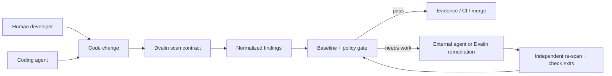

# Dvalin security runtime

Dvalin is an independent security verifier for code written by humans and AI
agents. The product boundary is not “which model writes the best code”; it is
the stable contract between code production and merge:

> Agent writes. Dvalin verifies.

## Architecture



The generic DvalinCode Agent Loop remains responsible for a single model turn
(`RESTORE → COMPACT → COMMAND → BUILD → RUN → SAVE → RESPOND`). Security
orchestration is a separate persisted state machine. This keeps model control
flow generic while making security transitions deterministic and resumable.

## Security workflow states

The version 1 workflow supports:

`created → scanning → ready/needs_work/passed → external_handoff/internal_fix → verifying → passed/needs_work → evidence_ready → publication_pending → published`

Blocked work can resume at scanning or verification. Workflows live under
`~/.dvalincode/security/workflows/` (or `DVALINCODE_HOME`) and contain compact
finding snapshots, not source snippets or prompts.

## Repository contract

Run:

```sh
dvalin init
dvalin baseline
dvalin scan
```

`dvalin.security.json` is a versioned repository policy:

```json
{
  "version": 1,
  "scanners": ["builtin"],
  "gate": { "severity": "high", "mode": "new" },
  "baseline": ".dvalin/baseline.json",
  "checks": ["test"],
  "suppressions": []
}
```

Unconfigured repositories remain compatible: the built-in scanner runs and the
gate is non-blocking. Initializing opts the repository into a high-severity,
new-findings gate. A suppression needs a fingerprint or rule, a reason, and may
also carry a path, owner, and expiry date. Expired suppressions are reported and
no longer hide findings.

Finding fingerprints are stable over path spelling normalization. Verification
also uses a conservative target fingerprint (scanner + rule + file), so moving
the same vulnerability within a file does not make it appear fixed.

## Interfaces

- Human CLI: `dvalin scan`, `baseline`, `verify`, `verify-fix`, `doctor`, and
  `scanners`.
- Compatibility CLI: `dvalincode security ...`; the earlier
  `dvalincode dvalin ...` repair command remains available.
- Agent MCP: `dvalin_scan`, `dvalin_get_finding`, `dvalin_verify_findings`,
  `dvalin_verify_fix`, `dvalin_list_scanners`, and optional governed coding
  and evidence tools. Structured tools return MCP `structuredContent`.
  `dvalin_verify_findings` executes the project's own checks — every command
  passes the same policy gate as any other execution, and a denied command is
  recorded as a check that did not pass rather than skipped.
- CI: the GitHub Action produces SARIF; a GitLab example is in
  `docs/examples/gitlab-ci.yml`.
- Editors: the VS Code extension and Dvalin workspace remain presentation
  layers over the same scanner suite.

## Verification boundary

Scanner results and actual process exit codes decide the gate. In automated
remediation, focused checks must run through `run_check`; Dvalin reads their
exit codes from the tamper-evident audit trail and then independently re-runs
the original scanners. The model's `DVALIN_VERIFICATION_PASSED` marker remains
only as a compatibility fallback for API callers that do not provide audit
evidence—it is not used by the automated publication path.

`dvalin verify <workflow-id>` runs the checks selected in
`dvalin.security.json` and reports `scan-and-checks` assurance. The MCP
verification tool reports `scan-only` because the calling agent owns its check
execution; the governed automated-remediation path separately requires recorded
`run_check` evidence before publication.

## Scanner installation

Dvalin Built-in always exists. Optional engines are detected from `PATH`.
`dvalin scanners install <id>` prints a fixed, reviewable command and does not
execute it. Adding `--yes` runs the fixed executable/argument vector under the
resolved Dvalin command and egress policy. Scanner discovery never triggers an
installation by itself. The Dvalin status UI uses the same fixed plan: its
download icon shows a native confirmation containing the exact command, calls a
workspace-restricted local endpoint, verifies the executable on `PATH`, and does
not require a configured model.

## Honest limits

- A passing scan is not proof that a program is secure.
- The health score is a triage heuristic, not a certification.
- Business-logic flaws may require threat modeling and human review.
- External scanners may access their own registries and advisory databases;
  availability and errors are included in the result.
- Dvalin can orchestrate a repair, but publication stays explicit and it never
  auto-merges a change.
