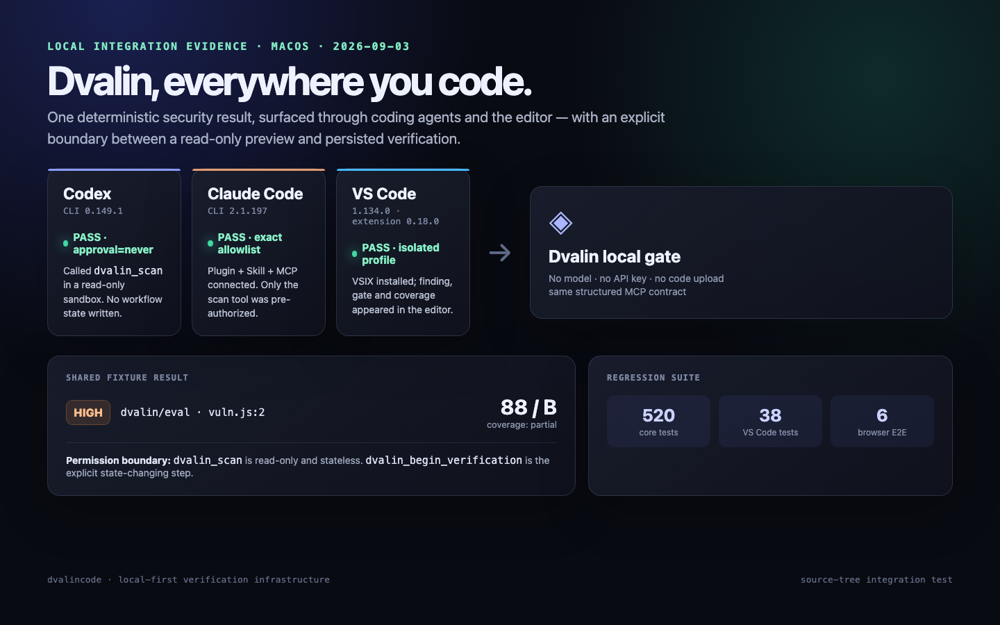
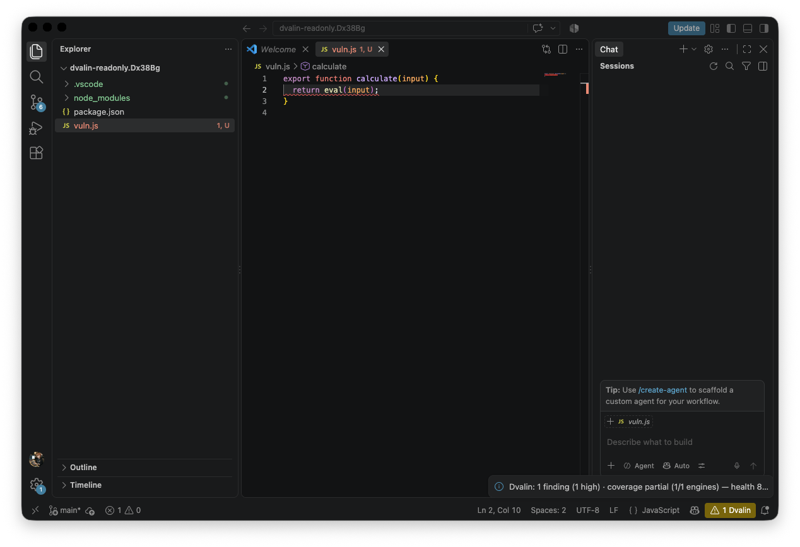

# Dvalin Security plugin

One plugin payload for Codex and Claude Code. It bundles the same autonomous
security-gate skill and local stdio MCP server for both ecosystems, so the
model-specific client is never the source of the verification verdict.

The package contains both `.codex-plugin/plugin.json` and
`.claude-plugin/plugin.json`, plus a shared `skills/` directory and `.mcp.json`.
It is ready to add to a Codex or Claude plugin marketplace; no marketplace is
committed here, so installing the repository does not silently enable a local
process for every contributor.

For development validation:

```sh
python3 ~/.codex/skills/.system/plugin-creator/scripts/validate_plugin.py integrations/dvalin-security
claude plugin validate integrations/dvalin-security
```

The MCP server starts with:

```sh
npx -y dvalincode mcp-serve --workspace .
```

Scanning and offline fix-record verification need no model, API key, or cloud
account. `dvalin_scan` is read-only and persists no state, so clients can allow
it by default. A local workflow is created only when
`dvalin_begin_verification` is explicitly called; project commands run only
when `dvalin_verify_findings` is subsequently called.

## Client permission behavior

- Codex consumes the MCP `readOnlyHint`, so `dvalin_scan` works with
  `approval=never`; workflow creation remains a separate state-changing tool.
- Claude Code deliberately requires explicit permission for every MCP tool,
  including read-only tools. Approve the scan once interactively, add only
  `mcp__plugin_dvalin-security_dvalin__dvalin_scan` to the permission allowlist,
  or pass it through `--allowedTools`. Do not use `bypassPermissions` for this.

The plugin cannot silently grant that Claude permission: plugin-shipped
`settings.json` supports only agent/status-line defaults. This preserves
Claude's trust boundary while keeping the grant as narrow as one read-only
tool. See Anthropic's [MCP permission documentation](https://code.claude.com/docs/en/agent-sdk/mcp).

Verified from this source tree on macOS on 2026-09-03:

| Client | Permission mode | Result |
|---|---|---|
| Codex 0.149.1 | `approval=never`, read-only sandbox | scan called, correct finding, no workflow state |
| Claude Code 2.1.197 | `dontAsk`, exact scan-tool allowlist | skill loaded, scan called, correct finding, no workflow state |



The packaged extension was also installed into a clean VS Code 1.134.0 profile.
The real editor result below shows the shared fixture finding and partial
coverage status from the same local scanner contract.


